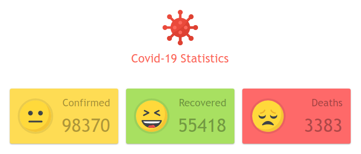

# COVID-19 STATS
> Covid-19 Statistics (https://covid19-stats.now.sh/)

  

## Introduce

Just a minimal dashboard (Base on [COVID-19 API](https://github.com/mathdroid/covid19), which serving data from John Hopkins University CSSE)

## Related

- [mathdroid/covid19](https://github.com/mathdroid/covid19) - API for this dashboard

## License

MIT © [Kyoz](mailto:banminkyoz@gmail.com)
